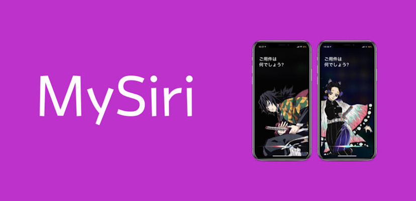

<h1 align="center">MySiri</h1>

Twitter         - [@Minazuki_dev](https://twitter.com/Minazuki_dev)

## MySiri
Display your favorite image on the Siri screen.  JPEG is not supported.  Be sure to use PNG images.  If it is not reflected, you need to respring twice.

## Compatibility

- iOS 13~13.5
- armv7s, arm64, arm64e

## Copyright
@Minazuki_dev 2020

